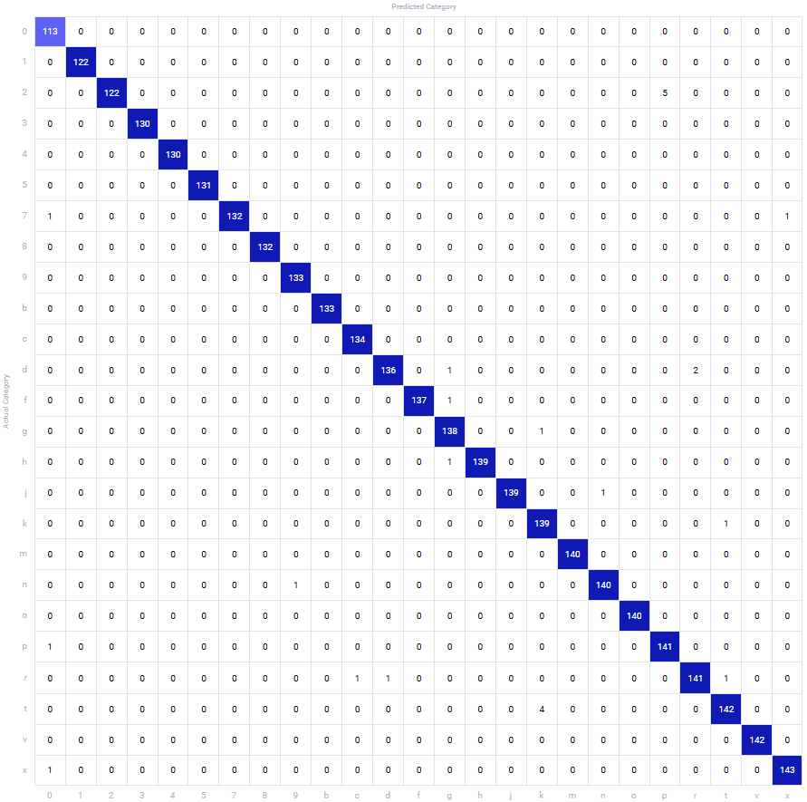

# American Sign Language Detection using EfficientNetB0

This project uses the **EfficientNetB0** CNN architecture for image classification of the American Sign Language (ASL) alphabet and 0-9 digits, with real-time detection support.

## Usage

### 1. Install Dependencies

Install all required libraries from the `requirements.txt` file:

```bash
pip install -r requirements.txt
```

### 2. Download Dataset

Download and extract the ASL dataset using the following command:

```bash
gdown https://drive.google.com/uc\?id\=1b0-MLad_AcVvbocCk7RUB2XH5Xbr7L3x
```

```bash
sudo apt install rar
unrar asl.rar
```

### 3. Train the Model

Before training, set up the `COMET_API_KEY` in a `.env` file inside the `neuralnet` directory to log metrics.

To train the model, run:

```bash
python3 ASL-Alphabet-Detection/neuralnet/train.py
```

> Hyperparameter configurations are available in `train.py`.

### 4. Run the Demo

To run the real-time detection demo:

```bash
python3 detect.py
```

> **Note**: If you don't have a webcam, you can use the DroidCam app to turn your mobile phone into a webcam. Logs will be saved in the `action_handler.log` file.

### 5. Pre-trained Model

You can use the pre-trained model `best_model.pth` located in the `assets/` directory to perform inference.

## Experiment Results

| Loss Curves | Accuracy Curves |
|-------------|-----------------|
|  |  |

> The best model was selected based on the highest test accuracy and was trained for 25 epochs, with the best results at epoch 22.

| Train Loss | Test Loss | Train Accuracy | Test Accuracy |
|------------|-----------|----------------|---------------|
| 0.052      | 0.028     | 0.984          | 0.990         |

> [!NOTE]
> Since the number of class labels was large and the test set was randomly sampled, not all labels were included in the evaluation. As a result, some labels may be missing from the confusion matrix.

|Confusion Matrix|
|-|
||
---

Feel free to report any issues you encounter.  
Don't forget to ⭐ the repo!
